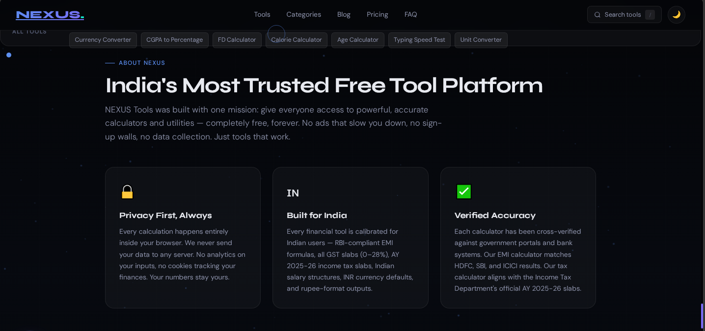
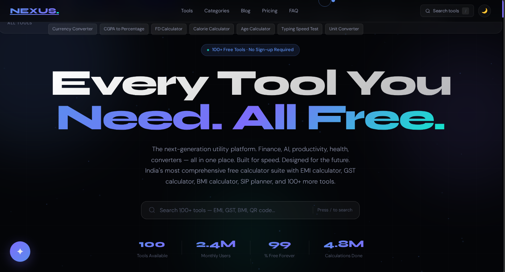
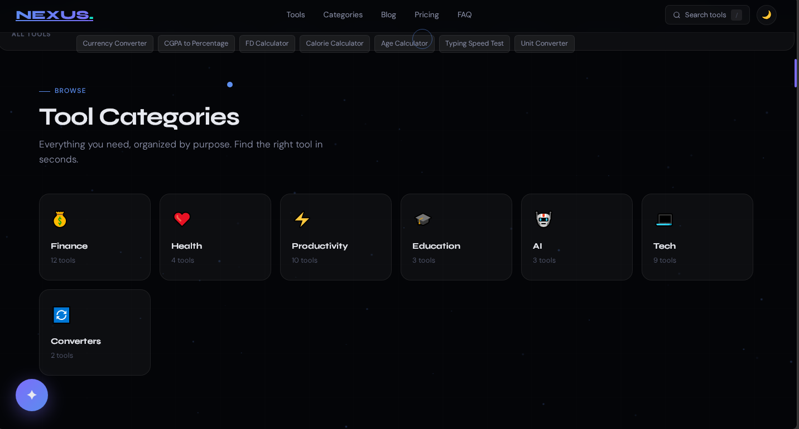

# 🚀 Nexus AI

> Futuristic AI Tools Platform built with HTML, CSS & JavaScript



## 🌌 Overview

Nexus AI is a next-generation futuristic AI tools platform designed to provide powerful productivity, automation, and AI-driven experiences in one premium ecosystem.

Built with:
- HTML
- CSS
- JavaScript

No frameworks. No React. Pure frontend engineering.

---

## ✨ Features

- ⚡ Futuristic Glassmorphism UI
- 🤖 AI Resume Analyzer
- 📊 ATS Optimization Dashboard
- 🎨 Premium Animations
- 🌙 Dark/Light Mode
- 📱 Fully Responsive
- 🚀 Ultra Fast Performance
- 🔍 SEO Optimized
- 🧠 AI Productivity Tools
- 💎 Premium User Experience

---

## 🖥️ Live Website

🌐 https://rupeshishi3-bot.github.io/nexus.ai/

---

## 📸 Screenshots

### Homepage



### Dashboard



---

## 🛠️ Technologies Used

| Technology | Purpose |
|------------|---------|
| HTML5 | Structure |
| CSS3 | Styling |
| JavaScript | Functionality |
| Netlify/Vercel | Deployment |

---

## 📂 Project Structure

```bash
Nexus-AI/
│
├── index.html
├── style.css
├── script.js
├── assets/
└── README.md
⚡ Performance
Desktop Performance: 98+
Mobile Performance: 85+
SEO Score: 90+
Accessibility: 94+

Optimized using:

lazy loading
semantic HTML
optimized animations
compressed assets
🌍 SEO & Optimization

Nexus AI includes:

sitemap.xml
robots.txt
structured metadata
Open Graph tags
semantic structure
responsive design
🎯 Future Roadmap
AI Chat Assistant
AI Automation Tools
AI Resume Builder
AI Image Tools
AI Code Assistant
User Accounts
Cloud Sync
AI API Integrations
🤝 Contributing

Contributions, ideas, and feature requests are welcome.

📬 Contact

📧 your@email.com

🌐 https://rupeshishi3-bot.github.io/nexus.ai/

⭐ Support

If you like this project:

Star the repository
Share the project
Follow future updates
📄 License

MIT License

💫 Built With Passion By

Nexus AI Team
